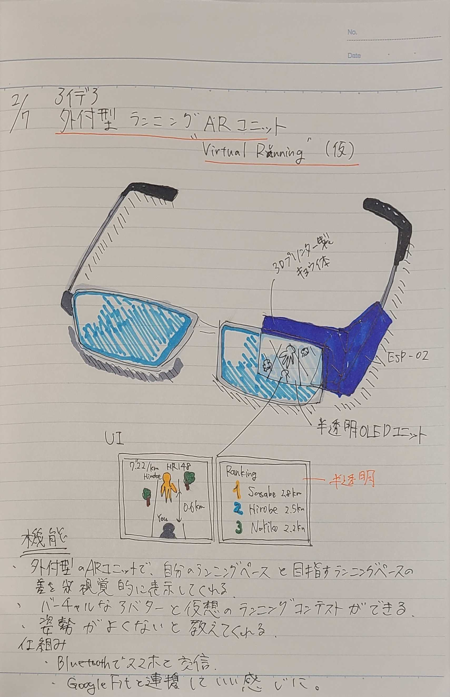

# 概要
- ランニングするときにいちいちスマートウォッチを見て、タイムを確認するのがだるい
- 以下のような感じで普通の眼鏡に外付けできるARユニットを開発したい
- シースル～ARだといいなぁ～
- 横にタッチパネルがついてて操作できるといいなぁ～
- ChatGPTと合体すること考えてカメラもついてるといいなぁ～
- ChatGPTと合体することを考えてマイクもついてるといいなぁ～

# スケジュール
- 2か月くらいで開発

# イメージ

# 材料
- M5 Glass Unit(表示インジケータ)
  - https://docs.m5stack.com/en/unit/Glass2%20Unit
- ATOM Echo(操作＋スピーカー＋マイク)
  - https://www.switch-science.com/products/6347
- GPSユニット
  - https://www.switch-science.com/products/5694
- バッテリーどうしようかなぁ
  - とりあえず普通のポータブルバッテリーでいいか・・・

# 機能
- 走行ペース表示機能、走行距離表示機能、総走行時間表示機能、走行姿勢警告機能、AIとの競争機能