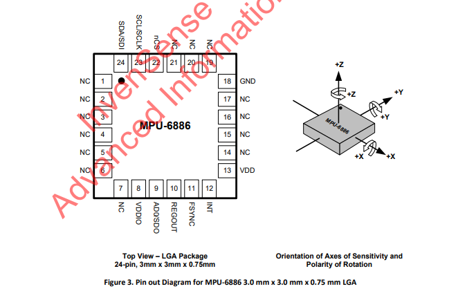
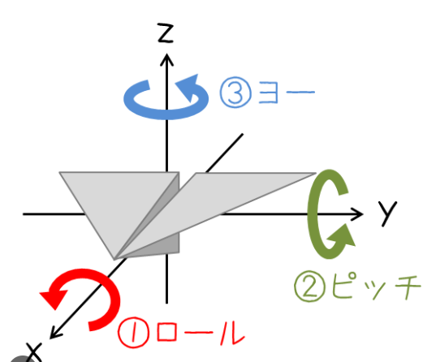

# 起動画面作成
- u8g2ライブラリを使うっぽい
  - https://github.com/olikraus/u8g2/wiki
- Glass2ユニットはSSD1309コントローラーを使っている
- fontリスト
  - https://github.com/olikraus/u8g2/wiki/fntlist8
- UI開発
  - photopia
    - https://www.photopea.com/
  - photopiaで使うフォント
    - https://ja.fonts2u.com/pixel-operator.%E3%83%95%E3%82%A9%E3%83%B3%E3%83%88#google_vignette
  - image2cpp
    - https://javl.github.io/image2cpp/

# 頭の向きによるデバイス操作
- 搭載しているMPU6886のマニュアルより
  - https://m5stack.oss-cn-shenzhen.aliyuncs.com/resource/docs/datasheet/core/MPU-6886-000193%2Bv1.1_GHIC_en.pdf

- 一般的なピッチ・ロール・ヨー

- 今回はX軸を使ってヨー角、Z軸を使ってピッチ角を求めればいいはず

- MPU6886じゃなく9250には地磁気センサーがついているらしい
  - 仕方ないのでロールだけでやるかぁ

# GPSを使ったRunning Vision開発
- 参考ページ
  - https://logikara.blog/gps/
